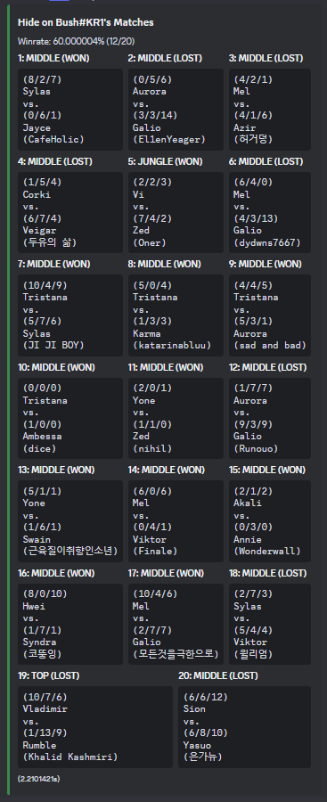
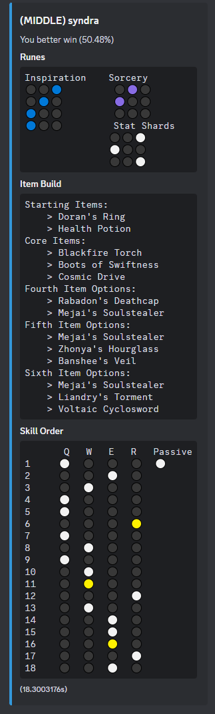

# Introduction

This Discord bot is a personal project aimed at leveraging my knowledge in computer science to create a tool that I find useful, while also exploring Rust as my first project in this language. The bot is designed to provide me with valuable insights by accessing Riot Games' API and scraping [U.gg](https://u.gg/) for information on the best builds, items, and champions.

## Purpose

The primary goal of this bot is to help me and my friends by offering quick access to league of legends information. It serves as a learning experience for me to develop a practical application using Rust, a language I am new to.

## Features

### Commands

The bot currently supports three main commands:

1. **`/build [champion] [optional: vs champion] [optional: lane]`**  
   Retrieves the best build for a specified champion, optionally against another champion. Due to performance issues with the Rust web scraper, the output is initially limited to runes and is updated approximately 20 seconds later to include item information.

2. **`/match [summoner name] [tag] [optional: region] [optional: game count]`**  
   Displays the last 20 matches played by a given summoner.

3. **`/counter [champion] [optional: lane]`**  
   Lists the best champion counters against a specified champion.

### Screenshots

#### Example Output for `/build` Command

#### Example Output for `/match` Command

#### Example Output for `/counter` Command

## Technical Details

- **Language:** Rust
- **APIs Used:** Riot Games API
- **Libraries:** Serenity, Reqwest, Scraper

## Roadmap

- **Optimize Web Scraping:** Improve the speed of the web scraper to reduce the delay in providing full build information.
- **Expand Command Set:** Add more commands to provide additional insights, such as champion statistics or patch notes summaries.
- **Explore Visiual Options:** Determine if it is possible for the output Emojigs to be icons
- **Autocomplete Champion Names:** Allow autocomplete of the over 200+ champion options
